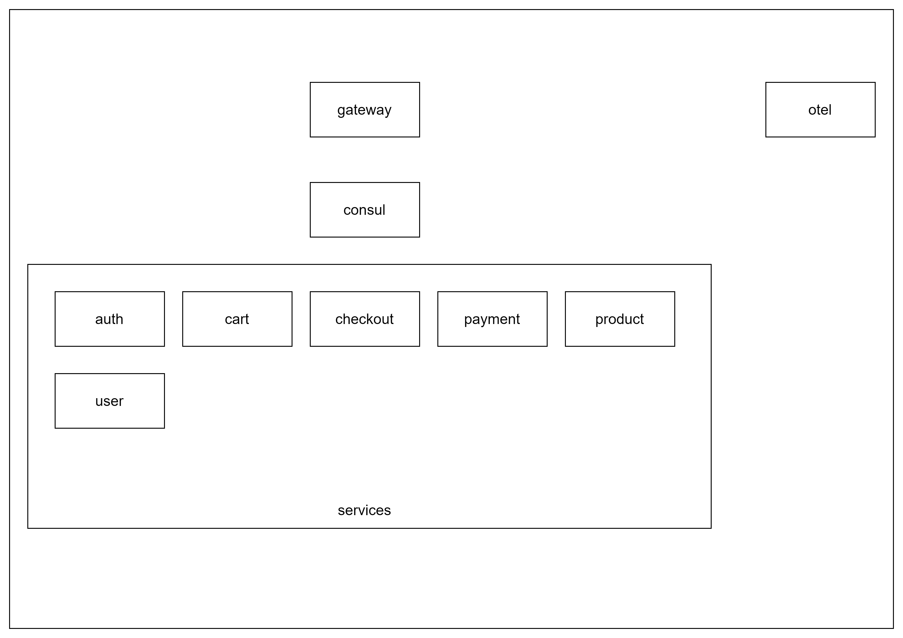

# 字节跳动青训营tiktok_e-commence项目

## 项目架构

http请求由网关处理，通过consul服务发现，路由到对应的服务，服务之间通过grpc调用。并且服务通过otel进行链路追踪。项目架构如下图所示：

## 功能实现

### Auth

[鉴权文档](app/auth/README.md)

- 分发身份令牌
- 续期身份令牌
- 校验身份令牌
- 拉黑用户
- 分配权限

### User

- 创建用户
- 登录
- 用户登出
- 删除用户
- 更新用户
- 获取用户身份信息

### Product

- 创建商品
- 修改商品信息
- 删除商品
- 查询商品信息

### Cart

- 创建购物车
- 清空购物车
- 获取购物车信息

### Order

[订单文档](app/order/README.md)

- 创建订单
- 修改订单信息
- 订单定时取消

### Checkout

- 订单结算

### Payment

- 支付

## postman测试

测试文件在`doc/TikMall.postman_collection.json`，导入postman即可使用。

